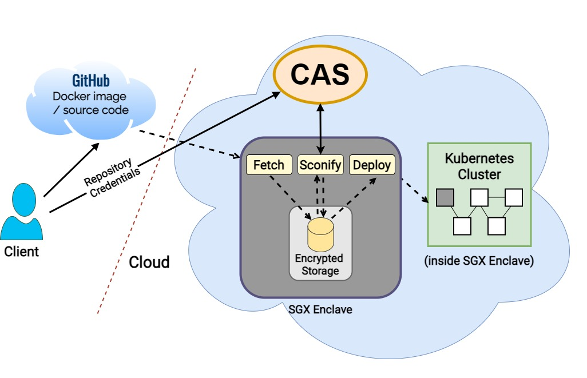
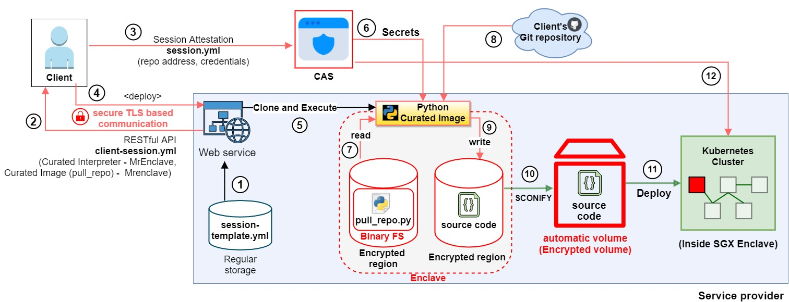
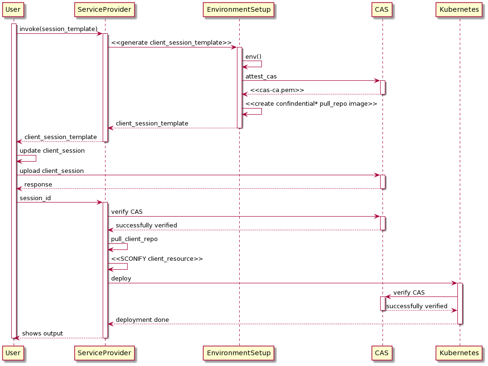

## Table of Contents

- [Secure Deployment Process <a name = "about_the_project"></a>](#secure-deployment-process-)
  - [Directory Structure <a name = "directory_structure"></a>](#directory-structure-)
  - [Requirements <a name = "requirements"></a>](#requirements-)
  - [Deployment <a name = "deployment"></a>](#deployment-)
  - [Contact <a name = "contact"></a>](#contact-)
  - [References <a name = "references"></a>](#references-)
---


<!-- ABOUT THE PROJECT -->
# Secure Deployment Process <a name = "about_the_project"></a>

The [Github SecureDeploymentProcess Git repository](https://github.com/shakil18/Secure-Deployment-Process) contains code for Automated secure application deployment in Kubernetes with [SCONE (Secure CONtainer Environment)](https://sconedocs.github.io/).

The goal is to first fetch a docker image from a repository (git clone) and store it inside an encrypted path on disk. <br>
Next, the encrypted image is needed to be adapted to use a SCONE base-image. SCONE is a shielded execution framework of Intel SGX. Following the sconification, a remote attestation CAS (the SCONE Configuration and Attestation Service) is to be used to store and provide necessary secrets (encryption keys). <br>
Finally, the application deployment will take place in the Kubernetes cluster using Helm charts. The dependency and requirements for the encrypted stored image will be implemented throughout the image execution.

The whole operation should take place in a fully automated working flow that starts after fetching a docker image.

> Architecture of the system:
> 

<br>
Though the higher level architecture shows and simplifies the overall process of the system, but the internal process of the system is more complicated. Below figure presents the general architecture and internal process between a client and service_provider.
<br>
<br>

**System implementation workflow:**


**Sequence diagram of the system:**


<br/>

<!-- DIRECTORY STRUCTURE -->
## Directory Structure <a name = "directory_structure"></a>

Here's a project's directory structure:

```text
Secure-Deployment-Process          
├── client                                          # Client's local application
│    ├── client_certificate                         # script generates client's public certificate and key              
│    ├── clientcertreq.conf                         # client's certificates config file    
│    ├── create_client_session.py                   # client's side application (source-code)
│    └── README.md                                  # Documentation
├── kubernetes_deployments                          # Client's remote app k8s deployment
├── service_provider
│    ├── automated_evaluation.sh                    # automated deployment without client interaction via web
│    ├── bundle_scripts.sh                          # bundle-several scripts for execution
│    ├── cleanup_system.sh                          # clean-up system from old deployments
│    ├── Dockerfile-pull-repo                       # Docker-image to run binary-fs
│    ├── env_global.sh                              # system environments variable
│    ├── helm-charts                                # directory, helm-charts
│    │   └── client-app                             # kubernetes client-app deployemt
│    |   └── las                                    # kubernetes las deployemt
│    ├── kubernetes_deploy.sh                       # script for deploying client-app into kubernetes 
│    ├── libbinary-fs.so                            # binary-fs for pulling client-repo
│    ├── pull_repo-binary-fs-creation               # directory, contains binary-fs creation file
│    ├── README.md                                  # Service_provider's documentation
│    ├── service_las.sh                             # starts docker las container
│    ├── service_pull_repo.sh                       # starts docker container to pull client-repo
│    └── session-template.yml                       # Template for client's session 
├── web_service                                     
│    ├── service_provider_session_handling.py       # web_service source-code
│    ├── session_files                              # contains client-session.yml
│    └── templates
│        └── index.html                             # web_service home page
└── README.md                            
```
<br/>

<!-- REQUIREMENTS  -->
## Requirements <a name = "requirements"></a>

**Client:**
- [Python-interpreter >= Python 3.6 <a href="https://www.python.org/downloads/"> </a>](python_download)


**Service-provider:**
- [Docker <a href="https://docs.docker.com/get-docker/"> </a>](python_download)
- [Minikube <a href="https://minikube.sigs.k8s.io/docs/start/"> </a>](Minikube)
- [Helm-charts <a href="https://helm.sh/docs/intro/install/"> </a>](Helm_charts)
- ```pip install Flask```
- Access to the registry: **registry.scontain.com:5050/sconecuratedimages/**

<br/>

<!-- DEPLOYMENT  -->
## Deployment <a name = "deployment"></a>
1. Execute the web-service application (automation_script/web_service/service_provider_session_handling.py):
```python
python3 service_provider_session_handling.py 
```
2. Open this address on the browser: http://0.0.0.0:5000/
3. Download the ***client-session.yml*** file by clicking on the "Download" button.
4. Copy the ***client-session.yml*** file to the **client** directory (automation_script/client)
5. Execute the client application (automation_script/client/create_client_session.py):
```python
python3 create_client_session.py
```
6. Copy the **Session-ID** and submit to the web-service (http://0.0.0.0:5000/).

<br/>

<!-- CONTACT -->
## Contact <a name = "contact"></a>

**Azizul Hakim Shakil** - [@ShakilAzizul](https://twitter.com/ShakilAzizul) - azizulhakim.shakil18@gmail.com

Project Link: [https://github.com/shakil18/Secure-Deployment-Process](https://github.com/rcrane/Secure-Deployment-Process)

<br/>

<!-- REFERENCES -->
## References <a name = "references"></a>
* [SCONE docs](https://sconedocs.github.io/)
